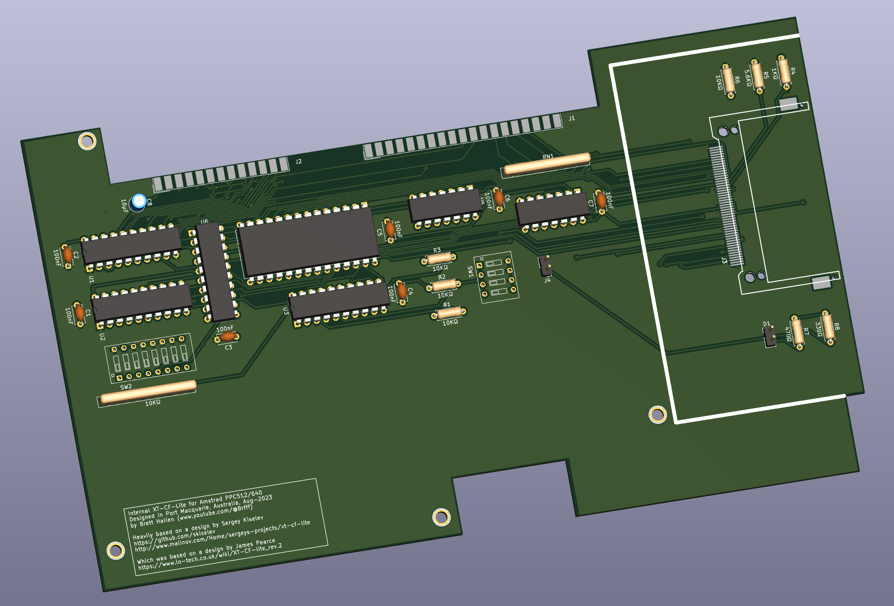

# Amstrad_PPC_XT_CF_Lite
Internal CF interface for the Amstrad PPC512/640

Replaces the internal modem board with a combination ISA interface & XT-IDE/Compact Flash interface.  

Heavily based on Sergey Kiselev's design 
[Github page](https://github.com/skiselev) 
[WWW page](http://www.malinov.com/Home/sergeys-projects/xt-cf-lite) 

Which is apparently a remake of James Pearce's card: 
[WWW page](http://www.lo-tech.co.uk/wiki/XT-CF-lite) 

I am using some of Sergey's Kicad symbols/footprints: 
[Sergey's Kicad symbols](https://github.com/skiselev/my_kicad_library) 

Changes requires for internal mounting in the Amstrad PPC: 
[1] The following signals are generated directly from the internal gate arrays and should be buffered with a non-inverting buffer (i.e. 72HC244): A00 to A07, !MEMW, !MEMR, !IOW, !IOR, RESET 
_(there are others but irrelevant for our purposes)_ 
[2] The data signals (D0 to D7) are at CMOS levels and should be pulled up to TTL levels with 10KΩ resistors 
[3] The internal modem board we are replacing is roughly 200x120mm 
[4] Technically the PPC should be powered by the "expansion unit" and not the other way around ... don't tell anyone 

Currently untested ...  

